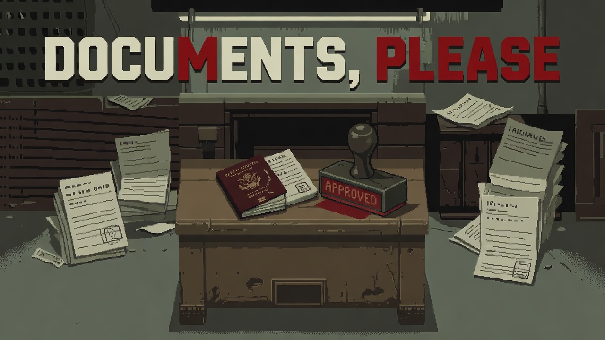
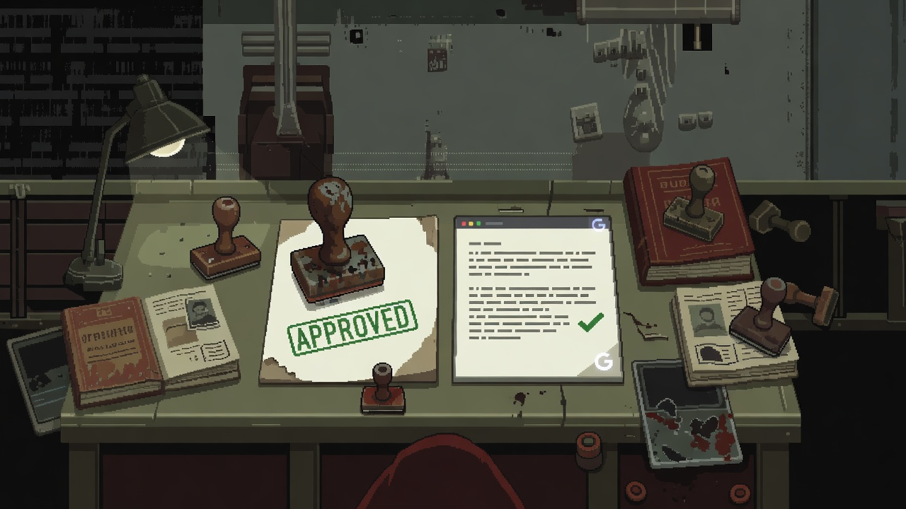
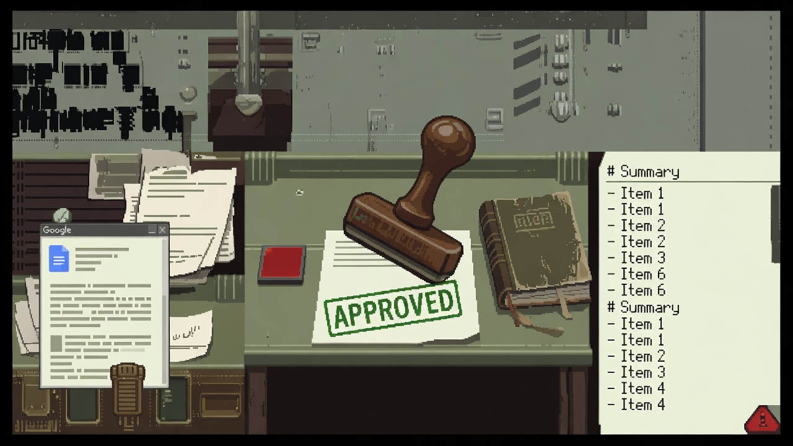

<p align="center">
  
</p>

# gdrive-to-markdown

> **Claude Code-скил: забирает Google Docs, Sheets и Slides в чистую Markdown-базу знаний — целиком, с авто-раскладкой по содержимому. Документы предъявлены, проверены, подшиты. Без API-ключей и настройки OAuth.**

[](LICENSE)
[](https://docs.claude.com/en/docs/claude-code/overview)

Даёте ссылку на гугл-документ — Claude скачивает его через официальный коннектор
Google Drive, чистит от артефактов экспорта и кладёт в вашу базу знаний (Obsidian,
репозиторий, любой Markdown-vault), сам выбирая правильную папку по содержимому.

```
/gdocs https://docs.google.com/document/d/.../edit
→ ✓ knowledge/projects/onboarding/Письмо №3.md
```

<p align="center">
  <br>
  <sub><i>Документ предъявлен — APPROVED — подшит в базу</i></sub>
</p>

---

## Зачем

Перенести гугл-док в базу знаний обычно значит: открыть, выделить, скопировать,
вставить, вычистить мусор разметки, придумать имя и папку. Каждый раз вручную.

`gdrive-to-markdown` делает это одной командой и добавляет то, что руками лень:

- **сохраняет документ целиком и дословно** — ничего не «пересказывает» и не теряет;
- **сам раскладывает по базе** — ищет подходящую папку/серию по содержимому;
- **не перезаписывает молча** — если такой документ уже есть, спрашивает;
- **подхватывает стиль соседних файлов** — frontmatter и формат, как у соседей.

## Возможности

- 📄 **Docs** → чистый Markdown
- 📊 **Sheets** → Markdown-таблицы (все вкладки книги, каждая — отдельный раздел)
- 🖼 **Slides** → текст по слайдам
- 🧭 **Авто-маршрутизация** по содержимому (продолжает существующие серии, темы)
- 🛡 **Защита от потерь**: документ сохраняется полностью; дубликат → вопрос
- 🖌 **Картинки/схемы**: коннектор отдаёт только текст — скил честно помечает
  пропавшую графику и просит прислать скриншоты, чтобы вложить их рядом
- 🔌 **Без инфраструктуры**: ни API-ключей, ни Google Cloud Console, ни OAuth —
  всё через встроенный в claude.ai коннектор Google Drive

## Требования

- [Claude Code](https://docs.claude.com/en/docs/claude-code/overview)
- Подключённый коннектор **«claude.ai Google Drive»** (бесплатный, встроенный)

## Установка

Скил — это два файла в папке `.claude/`. Скопируйте их в свой проект **или**
в глобальную папку Claude Code (`~/.claude/`), чтобы скил был доступен везде.

**В конкретный проект:**
```bash
git clone https://github.com/beaverbeard/gdrive-to-markdown.git
cp -r gdrive-to-markdown/.claude/skills/gdocs   .claude/skills/
cp    gdrive-to-markdown/.claude/commands/gdocs.md .claude/commands/
```

**Глобально (во все проекты):**
```bash
cp -r gdrive-to-markdown/.claude/skills/gdocs   ~/.claude/skills/
cp    gdrive-to-markdown/.claude/commands/gdocs.md ~/.claude/commands/
```

Перезапустите Claude Code — скил `gdocs` и команда `/gdocs` появятся в списке.

## Подключение Google Drive

Скилу нужен коннектор Google Drive от claude.ai (это **не** ваш OAuth — авторизацию
держит claude.ai, ключи не нужны):

1. В Claude Code набери **`/mcp`**
2. Выбери **«claude.ai Google Drive»** → **Authenticate** (или Reconnect)
3. В браузере выбери Google-аккаунт и **дай все права на чтение Drive**

Проверка готовности — спроси Claude «покажи мои последние файлы в Google Drive».
Если в ответ «requires re-authorization» или «insufficient scopes» — см.
[Решение проблем](#решение-проблем).

## Использование

```bash
# Текстовый документ
/gdocs https://docs.google.com/document/d/FILE_ID/edit

# Таблица (заберёт все вкладки)
/gdocs https://docs.google.com/spreadsheets/d/FILE_ID/edit

# Презентация (текст по слайдам)
/gdocs https://docs.google.com/presentation/d/FILE_ID/edit
```

Или просто словами: «забери вот этот гугл-док в базу: `<ссылка>`».

Claude скачает документ, определит, куда он логически относится, и **покажет
полный путь** к сохранённому файлу. Если такой файл уже есть — сначала спросит,
сохранить поверх или сделать копию.

## Как это работает

<p align="center">
  <br>
  <sub><i>Слева — гугл-док, справа — он же чистой заметкой с # заголовками и - списками</i></sub>
</p>

### Два жёстких правила

1. **Документ сохраняется целиком и дословно.** Не «ключевые мысли», не пересказ.
   Весь текст, все врезки, цитаты, таблицы, списки — на месте. Чистится только
   формат (экранирование, кривые таблицы), смысл не теряется.
2. **Дубликат → вопрос.** Если документ уже в базе, скил не перезаписывает молча,
   а спрашивает: сохранить поверх или сделать копию (и показывает, чем версии
   отличаются).

### Маршрутизация по содержимому

Скил читает документ, понимает, о чём он, и ищет в вашей базе подходящее место:
если это, например, «Письмо №5» из серии, где уже лежат №0–№4, — положит рядом и
продолжит нумерацию. Если очевидной папки нет, выберет тематическую (или спросит,
когда место реально неоднозначно). Frontmatter и стиль берёт у соседних файлов.

### Формат файла

В начале — frontmatter (в стиле вашей папки; базовый шаблон, если своего нет):

```yaml
---
source: <ссылка на google-документ>
type: gdoc | gsheet | gslides
saved: 2026-06-04
title: <название документа>
---
```

## Ограничения

- **Только текст.** Коннектор не переносит картинки, схемы, диаграммы и встроенные
  объекты. Скил это замечает, ставит метку `> ⚠️ Здесь была схема…` и просит
  прислать скриншоты, чтобы вложить их рядом (`assets/`).
- **Sheets:** забираются все вкладки книги (каждая — отдельный раздел).
- **Доступ** определяется аккаунтом, которым авторизован коннектор. Нет доступа к
  файлу — скил скажет прямо, а не выдумает содержимое.

## Решение проблем

**«requires re-authorization» / «insufficient scopes».** Коннектор подключён, но
прав не хватает или токен истёк. Зайди в `/mcp` → «claude.ai Google Drive» →
**Reconnect**, и на экране согласия Google поставь **все** галочки доступа к Drive.

**Браузер не открывается при авторизации (headless / SSH / удалённый сервер).**
Если Claude Code работает на сервере без браузера (например VS Code Remote),
кнопка `Reconnect` может не открыть окно. Перезагрузите окно редактора
(`Developer: Reload Window`) — после перезапуска Claude Code покажет **кликабельную
ссылку** авторизации, которую можно открыть в браузере на своём компьютере.

**Скил не виден.** Проверь, что файлы лежат в `.claude/skills/gdocs/SKILL.md` и
`.claude/commands/gdocs.md` (в проекте или в `~/.claude/`), и перезапусти Claude Code.

## FAQ

**Это платно?** Нет. Коннектор Google Drive в claude.ai бесплатный, Google Cloud и
биллинг не нужны.

**Нужны ли API-ключи / OAuth-приложение?** Нет. Авторизацию держит claude.ai, вы
только подтверждаете доступ в браузере.

**Работает с расшаренными мне файлами?** Да, если у вашего аккаунта есть доступ.

**Перезапишет мои заметки?** Нет — при совпадении имени всегда спрашивает.

## Вклад

PR и issue приветствуются. Скил — это обычный Markdown в `.claude/skills/gdocs/`,
менять легко. Идеи: поддержка картинок через export, импорт комментариев Google
Docs, выбор формата таблиц.

## Лицензия

[MIT](LICENSE) © 2026 Rodion Scryabin ([@beaverbeard](https://github.com/beaverbeard))
